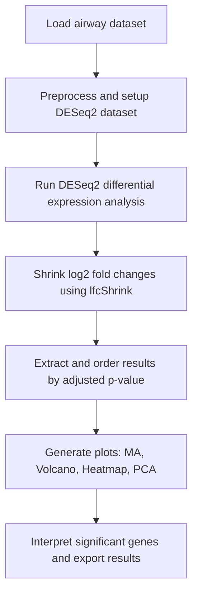

# 📊 RNA-Seq DGE Analysis on Human Airway Smooth Muscle Cells using DESeq2

## 🧬 Introduction

This project demonstrates a complete RNA-Seq differential gene expression (DGE) analysis using the **`airway`** dataset in R. The data consists of human airway smooth muscle cells, with some samples treated with the glucocorticoid **dexamethasone**, a drug commonly used in the treatment of **asthma** and other airway inflammatory conditions.

The purpose of this analysis is to identify genes that show **significant changes in expression** in response to dexamethasone treatment. This pipeline employs the **DESeq2** package for robust statistical testing and visualization.

## 🔄 Workflow Overview



This diagram summarizes the typical RNA-Seq DGE pipeline using DESeq2 with the airway dataset. Each step is implemented in the script and reproducible using R.

## 📂 Contents

- `data/`: Contains processed data files (if applicable)
- `scripts/`: Contains R scripts for each step of the analysis
- `plots/`: Output figures like MA plot, volcano plot, PCA, heatmap
- `results/`: Differential expression results in CSV/TSV format
- `README.md`: Project overview (this file)

## 🧰 Tools and Packages Used

- R (≥ 4.0)
- R packages:
  - `DESeq2`
  - `airway`
  - `ggplot2`
  - `pheatmap`
  - `EnhancedVolcano`
  - `tidyverse`
  - `BiocManager`

## 🔬 Dataset

- **Source**: [Bioconductor airway package](https://bioconductor.org/packages/release/data/experiment/html/airway.html)
- **Organism**: *Homo sapiens* (Human)
- **Cell Type**: Human airway smooth muscle (ASM) cells
- **Conditions**: Untreated vs. Dexamethasone-treated
- **Publication**: Himes et al., PLOS ONE, 2014 [DOI: 10.1371/journal.pone.0099625](https://doi.org/10.1371/journal.pone.0099625)

## 🧪 Methodology

### 1. **Loading the Dataset**
```r
library(airway)
data("airway")
```

### 2. **Preparing DESeqDataSet**
```r
library(DESeq2)
airway$dex <- relevel(airway$dex, ref = "untrt")
dds <- DESeqDataSet(airway, design = ~ dex)
```

### 3. **Running Differential Expression Analysis**
```r
dds <- DESeq(dds)
res <- results(dds)
```

### 4. **Shrinking Log Fold Changes**
```r
resLFC <- lfcShrink(dds, coef="dex_trt_vs_untrt", type="apeglm")
```

### 5. **Visualization**
- MA plot
- Volcano plot
- Heatmap of top genes
- Principal Component Analysis (PCA)

### 6. **Result Extraction**
```r
resOrdered <- res[order(res$padj), ]
write.csv(as.data.frame(resOrdered), file = "results/deseq2_results.csv")
```

## 📈 Example Visualizations

- **MA Plot**  
- **Volcano Plot**
- **Heatmap of Top Variable Genes**
- **PCA Plot**

(Include image links here if you've generated these plots and stored them in the `plots/` folder.)

## ✅ Key Findings

- Identified several genes significantly **upregulated or downregulated** by dexamethasone.
- Genes with adjusted p-value (`padj`) < 0.05 were considered significant.
- Notably affected genes include **ENSG00000000971**, **ENSG00000001167**, and others involved in inflammatory response.

## 📌 How to Reproduce

1. Clone the repository:
   ```bash
   git clone https://github.com/yourusername/airway-deseq2-analysis.git
   cd airway-deseq2-analysis
   ```

2. Open `scripts/deseq2_analysis.R` in RStudio or your R environment.

3. Run scripts step by step or source entire script to perform full analysis.


## 📚 References

- Love, M.I., Huber, W., & Anders, S. (2014). Moderated estimation of fold change and dispersion for RNA-seq data with DESeq2. *Genome Biology*. https://doi.org/10.1186/s13059-014-0550-8
- Himes, B. E., et al. (2014). RNA-Seq transcriptome profiling identifies CRISPLD2 as a glucocorticoid responsive gene. *PLOS ONE*. https://doi.org/10.1371/journal.pone.0099625

## ✍️ Author

- **ASTHA**
- Contact: asthayadav0904@gmail.com
- GitHub: [@Asthayadav09](https://github.com/Asthayadav09/airway-RNA-Seq-Dataset/new/main?filename=README.md)

## 📜 License

This project is licensed under the MIT License.
